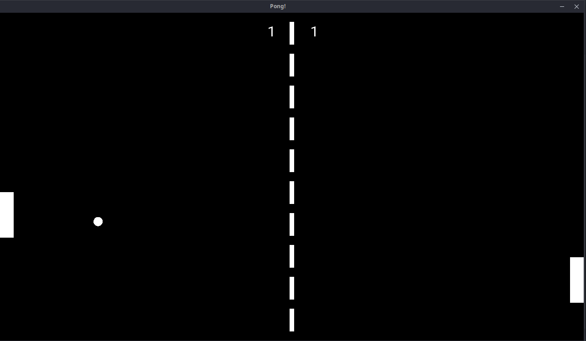
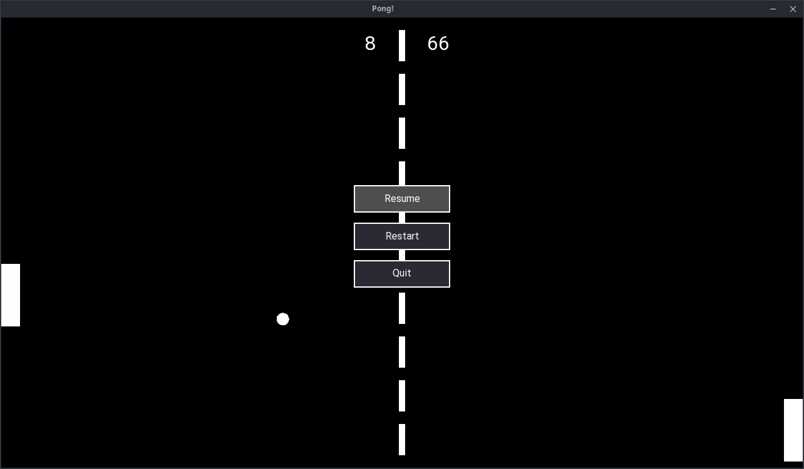

# Pong

Desenvolvido em C++ usando a biblioteca SFML e o padrão Entity-Component-System (ECS). O jogo também inclui um menu para reiniciar ou sair do jogo.

# Gameplay

# Menu

# Requisitos

SFML

# Compilar e executar

> make
>
> ./build/apps/pong

# Controles

Setas para cima e para baixo para controlar o movimento da barra e navegação no menu

ESC -> Abrir Menu
Space -> Selecionar opção